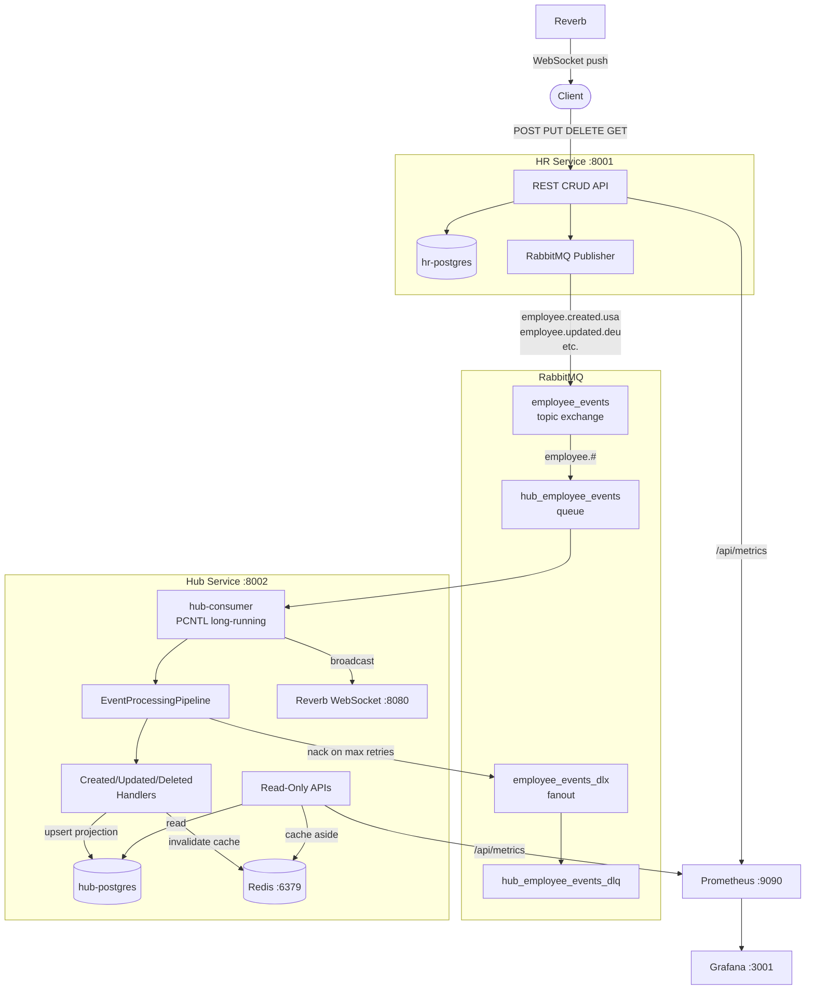
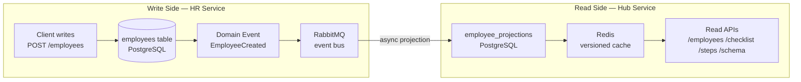
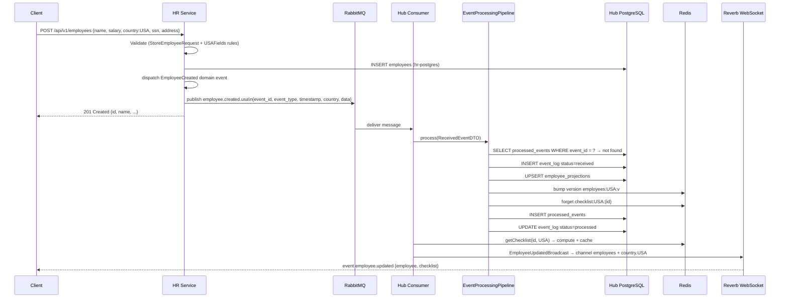
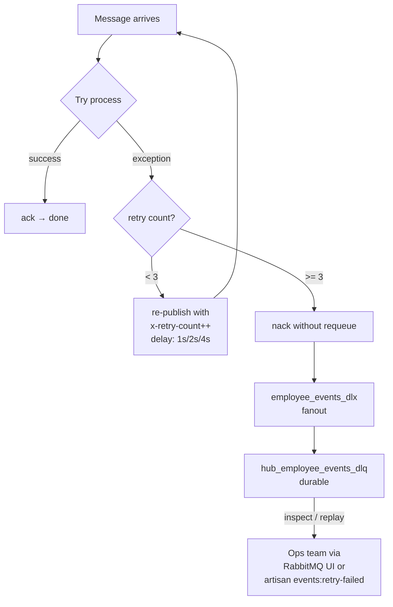

# Event-Driven Multi-Country HR Platform

A production-ready, event-driven microservices platform built as a Senior Backend Engineer coding challenge. It manages employees across multiple countries (USA, Germany) with real-time WebSocket broadcasting, Redis caching, dead-letter queues, and full observability through Prometheus + Grafana.

---

## Table of Contents

1. [Quick Start](#1-quick-start)
2. [Challenge Requirements vs Implementation](#2-challenge-requirements-vs-implementation)
3. [Architecture](#3-architecture)
4. [Why CQRS](#4-why-cqrs)
5. [Event Flow Deep Dive](#5-event-flow-deep-dive)
6. [RabbitMQ Topology](#6-rabbitmq-topology)
7. [Caching Strategy](#7-caching-strategy)
8. [Services & Ports](#8-services--ports)
9. [API Reference](#9-api-reference)
10. [Country-Specific Logic](#10-country-specific-logic)
11. [Testing](#11-testing)
12. [Observability](#12-observability)
13. [How to Add a Country](#13-how-to-add-a-country)

## Documentation

Detailed docs live in the [`docs/`](docs/) folder:

| Doc | Description |
|-----|-------------|
| [Overview](docs/overview.md) | Platform summary, tech stack, service health |
| [Installation](docs/installation.md) | Prerequisites, quick start, all services, credentials |
| [Architecture](docs/architecture.md) | DDD layers, directory structure, architecture rules |
| [Why DDD?](docs/whyddd.md) | Why DDD over traditional Laravel, layer responsibilities, trade-offs |
| [CQRS](docs/cqrs.md) | Command/Query separation, write/read sides, trade-offs |
| [Event Flow](docs/eventflow.md) | RabbitMQ topology, routing keys, retry strategy, pipeline |
| [Logging](docs/logging.md) | Log channels, levels, structured context, access via Docker |
| [Caching](docs/caching.md) | Cache keys, eager rebuild, Redis configuration |
| [Countries](docs/countries.md) | Supported countries, auto-discovery, adding a new country |
| [API Reference](docs/api.md) | All endpoints, validation rules, error format, rate limits |
| [Testing](docs/testing.md) | Test suites, commands, test database setup |
| [Observability](docs/observability.md) | Prometheus metrics, scrape config |
| [Grafana](docs/grafana.md) | 4 auto-provisioned dashboards |
| [Hub UI](docs/hubui.md) | Server-driven Blade SPA, live events, DEU-specific steps |
| [Seed Data](docs/seeddata.md) | Seed script usage, lifecycle phases, data tiers |
| [Deviations](docs/deviations.md) | Deliberate deviations from the challenge spec with rationale |
| [ADRs](docs/adr.md) | All 13 Architecture Decision Records in a single file |

---

## 1. Quick Start

```bash
docker compose up -d --build
```

That single command starts all 10 services, runs migrations, and the platform is fully operational. No manual steps.

| URL | Purpose |
|-----|---------|
| `http://localhost:8001` | HR Service — employee CRUD |
| `http://localhost:8001/docs/api` | HR OpenAPI docs |
| `http://localhost:8002` | Hub Service — UI / read APIs |
| `http://localhost:8002/docs/api` | Hub OpenAPI docs |
| `http://localhost:8002/websocket-test.html` | WebSocket live test page |
| `http://localhost:15672` | RabbitMQ Management UI (guest / guest) |
| `http://localhost:9090` | Prometheus |
| `http://localhost:3001` | Grafana dashboards (admin / admin) |

---

## 2. Challenge Requirements vs Implementation

The challenge asked for an **event-driven HubService** that consumes from a self-built HR Service. Every requirement is covered:

### Core Services

| Requirement | Implementation | Notes |
|-------------|---------------|-------|
| HR Service with employee CRUD | `hr-service` on port 8001 | Full REST: POST/GET/PUT/DELETE `/api/v1/employees` |
| HubService as main orchestrator | `hub-service` on port 8002 | Read-only APIs, projection store |
| Separate databases per service | `hr-postgres` + `hub-postgres` | No cross-DB queries ever |
| Single `docker compose up` start | `docker-compose.yml` with all 10 services | Entrypoints handle key gen + migrations |

### Events (Section 3.4, 6.1–6.2)

| Requirement | Implementation | Notes |
|-------------|---------------|-------|
| Publish EmployeeCreated/Updated/Deleted | `PublishEmployeeEventToRabbitMQ` listener | Fires on domain events after each CRUD action |
| Payload with `event_type`, `event_id`, `timestamp`, `country`, `data` | `EventPayload` value object | UUID per event for idempotency; schema at `contracts/employee-event.schema.json` |
| Country-specific routing | Routing key: `employee.{action}.{country}` e.g. `employee.created.usa` | Topic exchange — enables future per-country consumers |
| Consume + route to handlers | `EventProcessingPipeline` + per-event-type handlers | Clean separation: pipeline orchestrates, handlers act |
| Retry logic + error handling | 3 retries with exponential backoff (1s / 2s / 4s) | Failed messages go to Dead Letter Queue |
| Processing log | `event_log` table in Hub DB | Records every event: received → processed / failed |
| Idempotency | `processed_events` table | Skips re-processing if `event_id` already seen |

### Checklist System (Section 5.1)

| Requirement | Implementation | Notes |
|-------------|---------------|-------|
| Track completion per employee | `ChecklistService::computeCompleteness()` | Runs real Laravel `Validator::make()` against projection fields |
| Country-specific rules | `USAModule::validationRules()` / `DEUModule::validationRules()` | No if/else — polymorphic country modules |
| USA: ssn + salary + address | `USAModule` | SSN regex `^\d{3}-\d{2}-\d{4}$` |
| Germany: salary + goal + tax_id | `DEUModule` | Tax ID regex `^DE\d{9}$` |
| Completion % per employee | Validator error count → field % → step % → overall % | Grouped into named steps (Compensation, Identity, etc.) |
| Cache expensive calculations | `cache()->remember()` under `checklist:{country}:{id}` TTL 1h | Warmed after each event |
| Cache invalidation on events | `InvalidatesCache` trait in all 3 handlers | Deletes checklist key + bumps employee-list version |
| GET /api/checklists | `GET /api/v1/checklist/{country}` | Returns paginated per-employee status |

### Server-Driven UI APIs (Section 5.2)

| Requirement | Implementation | Notes |
|-------------|---------------|-------|
| GET /api/steps — navigation by country | `GET /api/v1/steps/{country}` | USA: 2 steps; DEU: 3 steps (Dashboard, Employees, Documentation) |
| GET /api/employees — with column definitions | `GET /api/v1/employees/{country}` | Column metadata included in response so frontend knows what to render |
| USA: show SSN masked | `USAModule::tableColumns()` | SSN column has `masked: true` flag |
| Germany: show Goal instead of SSN | `DEUModule::tableColumns()` | Columns differ per country, driven by module |
| GET /api/schema — widgets per country | `GET /api/v1/schema/{country}` | USA: count + avg salary + completion rate; DEU: count + goal tracking |
| Dashboard widgets differ by country | `USAModule::dashboardWidgets()` / `DEUModule::dashboardWidgets()` | Widget data source + WebSocket channel encoded in response |

### Real-Time WebSocket (Section 6.3)

| Requirement | Implementation | Notes |
|-------------|---------------|-------|
| WebSocket server in Docker | **Laravel Reverb** in its own `reverb` container | Replaced Soketi (see [Why Reverb](#websocket-why-reverb)) |
| Broadcast after processing events | `EmployeeUpdatedBroadcast` dispatched by consumer | Broadcasts country + checklist result |
| Channel by country | `country.{country}` public channel | Plus global `employees` channel |
| HTML test page | `hub-service/src/public/websocket-test.html` | Connect, subscribe, display events in real time |

### Caching (Section 6.4)

| Requirement | Implementation | Notes |
|-------------|---------------|-------|
| Choose and justify caching tech | **Redis 7** | AOF persistence, sub-ms latency, native Laravel support |
| Cache employee lists | Versioned key: `employees:{country}:v{n}:p{page}:pp{perPage}` | Version bump on any event = instant invalidation without key iteration |
| Cache checklist calculations | `checklist:{country}:{employeeId}` TTL 1h | Summary: `checklist_summary:{country}` TTL 1h |
| Cache-aside pattern | `cache()->has()` → `cache()->get()` / compute + store | Hit/miss tracked to Prometheus counters |

### Docker (Section 7)

| Requirement | Implementation |
|-------------|---------------|
| RabbitMQ with management UI | `rabbitmq:3.13-management` on ports 5672 / 15672 |
| PostgreSQL | Two separate instances: `hr-postgres:5433`, `hub-postgres:5434` |
| All services communicate | `platform` bridge network; services reference each other by container name |
| One-command start | `docker compose up -d --build` |

### Code Quality & Testing (Section 8)

| Requirement | Implementation |
|-------------|---------------|
| Clean Architecture | 4-Layer DDD: Domain / Application / Infrastructure / HTTP |
| Dependency injection | All controllers/handlers inject interfaces, bound in `AppServiceProvider` |
| Interface-based design | `EmployeeRepositoryInterface`, `CountryModuleInterface`, `CountryFieldsInterface`, `EventHandlerInterface` |
| Form Requests | `StoreEmployeeRequest`, `UpdateEmployeeRequest` with dynamic country rules |
| Resource classes | `EmployeeResource` wraps projection output |
| Unit tests | Value objects, DTOs, actions, handlers, pipeline |
| Integration tests | Event pipeline, cache behaviour |
| Feature tests | Every API endpoint tested end-to-end |
| Architecture tests | Pest Arch — enforces no domain→infra coupling, readonly DTOs, final classes |

### Deviations from the Challenge Spec (and why)

The challenge gave flexibility on several technology choices. Here is exactly what we picked and the reasoning:

**1. WebSocket: Laravel Reverb instead of Pusher/Soketi**

The spec lists Pusher (recommended) and Soketi as the two options. We chose **Laravel Reverb** — the official first-party WebSocket server shipped with Laravel 11+. It:
- Needs no Pusher account or external service
- Ships with the same `pusher` broadcast driver protocol, so all existing Laravel broadcast code works unchanged
- Runs as a Docker container like every other service — fully self-hosted, fully reproducible
- Has native Prometheus-compatible metrics via the existing Laravel HTTP stack

**2. Single PostgreSQL → two separate PostgreSQL instances**

The spec lists one `PostgreSQL` service in the Docker Compose requirements. We run two (`hr-postgres:5433`, `hub-postgres:5434`). The reason is that the challenge explicitly requires two services each with their own responsibilities. If they share an instance, a misconfigured query in one service can read the other's tables — defeating the separation the challenge is testing. Two instances make that impossible at the network level, not just by convention.

**3. Country codes: ISO 3166-1 alpha-3 instead of plain strings**

The spec uses `"country": "Germany"` in its payload examples. We use `"country": "DEU"` (ISO 3166-1 alpha-3). Reasons:
- RabbitMQ routing keys use the country suffix: `employee.created.deu`. A full name like `employee.created.germany` works but is non-standard; ISO codes are the universal convention for routing and API keys.
- A `CountryCode` backed enum (`USA`, `DEU`) is type-safe — the compiler rejects invalid values rather than letting `"Germeny"` silently flow through the system.
- API consumers get a stable, predictable key regardless of how the country's display name changes.

**4. Retry + DLQ: full idempotency pipeline instead of basic error handling**

The spec asks to "implement proper error handling and retry logic" without specifying depth. We implemented:
- 3 retries with exponential backoff (1s / 2s / 4s), re-publishing to the exchange rather than requeuing in-place
- Dead Letter Exchange + Dead Letter Queue for messages that exhaust retries — visible in the RabbitMQ Management UI
- `processed_events` table for idempotency — if the same `event_id` is delivered twice (e.g., after a broker restart), the second delivery is a no-op
- `event_log` append-only audit table — every event's full lifecycle (received → processed / failed) is recorded and replayable

These are standard production RabbitMQ patterns. The spec left room for exactly this kind of thinking.

**5. Server-driven UI: per-country path parameter instead of query string**

The spec defines endpoints as `GET /api/checklists?country=USA`, `GET /api/employees?country=USA`, etc. We use path parameters: `GET /api/v1/checklist/USA`, `GET /api/v1/employees/USA`. Path parameters make the country a first-class resource identifier, work correctly with HTTP caching layers, and result in cleaner OpenAPI documentation. The `v1` prefix is also added for API versioning.

---

## 3. Architecture

### System Overview



### CQRS Write / Read Separation



---

## 4. Why CQRS

The challenge defines two services with **separate databases** and a clear split in responsibility:

- **HR Service** is write-heavy: it accepts mutations (create/update/delete) and is the authoritative source of truth for employee data.
- **Hub Service** is read-heavy: it serves UI configuration APIs, paginated employee lists, checklists, steps, and schema — all read-only.

This maps naturally onto **Command Query Responsibility Segregation (CQRS)**:

| CQRS Concept | Our Implementation |
|---|---|
| **Command side** (writes) | HR Service — owns `employees` table, accepts REST mutations, emits domain events |
| **Query side** (reads) | Hub Service — owns `employee_projections` table, serves all UI / read APIs |
| **Event bus** (sync) | RabbitMQ topic exchange — decouples write from read, async propagation |
| **Projection** | `EmployeeProjection` model updated by event handlers — denormalised, read-optimised store |
| **Read optimisation** | Redis versioned cache on top of projections — API reads hit memory, not disk |

### Benefits in this context

**Independence**: If HR Service goes down, Hub continues serving reads from its own projection store. Users can still see employee lists, checklists, and UI config — they just won't see new writes until HR recovers.

**Scalability**: The read side (Hub) can be scaled horizontally without affecting the write side. The read model can be shaped differently from the write model (e.g., Hub adds `doc_*` columns and `raw_data` JSON that HR doesn't have).

**Auditability**: Every state change passes through the event bus and is logged in `event_log`. The projection is fully **replayable** — if you delete `employee_projections` and replay all events from `event_log`, you get the same final state.

### The trade-off

Data is **eventually consistent** — there's a window (typically < 100ms in practice) where HR has a new employee that Hub hasn't projected yet. This is acceptable for a UI-facing onboarding platform where sub-second staleness is invisible to users.

---

## 5. Event Flow Deep Dive



### What happens on failure



---

## 6. RabbitMQ Topology

```
Exchange: employee_events  (type: topic, durable)
  Routing keys published:
    employee.created.usa
    employee.updated.usa
    employee.deleted.usa
    employee.created.deu
    employee.updated.deu
    employee.deleted.deu
    employee.created.{any_future_country}

  Binding: employee.#  ──►  Queue: hub_employee_events
                              durable
                              x-message-ttl: 86400000  (24h)
                              x-dead-letter-exchange: employee_events_dlx

On 3rd failed retry:
  nack  ──►  Exchange: employee_events_dlx  (fanout, durable)
               └──►  Queue: hub_employee_events_dlq  (durable)
```

The **topic exchange** with country-suffixed routing keys means a future consumer could bind `employee.#.fra` to only receive France events — zero changes to HR Service needed.

---

## 7. Caching Strategy

### Employee list — versioned keys

Instead of iterating and deleting individual page keys, each country has a **version counter** in Redis.

```
employees:USA:v          →  integer (bumped on every USA employee event)
employees:USA:v{n}:p1:pp20  →  paginated data  TTL 1h
employees:USA:avg:v{n}      →  average salary   TTL 1h
```

When any employee event arrives: `version++`. All old keys become **orphaned** (never requested again, expire naturally). No key-scan loops, no race conditions.

### Checklist — per-employee + summary

```
checklist:USA:42         →  computed checklist for employee 42   TTL 1h
checklist_summary:USA    →  aggregate stats for all USA employees TTL 1h
```

Invalidated on every event for that employee. The per-employee cache is **warmed immediately** after invalidation — the consumer fetches and caches the new checklist before broadcasting the WebSocket event, so the first API request after an event always hits cache.

### Cache-aside implementation

```php
$version  = cache()->get("employees:{$country}:v", 0);
$cacheKey = "employees:{$country}:v{$version}:p{$page}:pp{$perPage}";
$employees = cache()->remember($cacheKey, 3600, fn() => $this->repository->paginateByCountry(...));
```

Cache hits and misses are tracked to Prometheus (`app_cache_hits_total`, `app_cache_misses_total`).

---

## 8. Services & Ports

| Service | External Port | Purpose | Health Check |
|---------|--------------|---------|-------------|
| `hr-service` | 8001 | Employee CRUD REST API | `GET /api/health` |
| `hub-service` | 8002 | Onboarding read APIs | `GET /api/health` |
| `hub-consumer` | — | RabbitMQ event consumer (long-running) | `pgrep rabbitmq:consume` |
| `reverb` | 8080 | Laravel Reverb WebSocket server | `curl :8080` |
| `hr-postgres` | 5433 | HR write database | `pg_isready` |
| `hub-postgres` | 5434 | Hub projection database | `pg_isready` |
| `redis` | — | Versioned cache (AOF persistence) | `redis-cli ping` |
| `rabbitmq` | 5672 / 15672 | Message broker + management UI | `rabbitmq-diagnostics` |
| `prometheus` | 9090 | Metrics scraping | — |
| `grafana` | 3001 | Dashboards | `GET :3000/api/health` |

### Credentials

| Service | Username | Password |
|---------|---------|---------|
| RabbitMQ Management | `guest` | `guest` |
| Grafana | `admin` | `admin` |
| HR PostgreSQL | `hr_user` | `hr_password` |
| Hub PostgreSQL | `hub_user` | `hub_password` |

---

## 9. API Reference

### HR Service (port 8001)

| Method | Path | Description |
|--------|------|-------------|
| `GET` | `/api/health` | Health check (DB + RabbitMQ config) |
| `GET` | `/api/metrics` | Prometheus metrics |
| `GET` | `/api/v1/employees` | List employees (paginated) |
| `POST` | `/api/v1/employees` | Create employee |
| `GET` | `/api/v1/employees/{id}` | Get employee by ID |
| `PUT` | `/api/v1/employees/{id}` | Update employee |
| `DELETE` | `/api/v1/employees/{id}` | Delete employee |

**USA employee body:**
```json
{
  "name": "John",
  "last_name": "Doe",
  "salary": 75000,
  "country": "USA",
  "ssn": "123-45-6789",
  "address": "123 Main St, New York"
}
```

**DEU employee body:**
```json
{
  "name": "Hans",
  "last_name": "Mueller",
  "salary": 65000,
  "country": "DEU",
  "tax_id": "DE123456789",
  "goal": "Increase team productivity by 20%"
}
```

**Error envelope (all 4xx/5xx):**
```json
{
  "error": {
    "code": "VALIDATION_ERROR",
    "message": "The ssn field is required.",
    "details": { "ssn": ["The ssn field is required."] }
  }
}
```

### Hub Service (port 8002)

| Method | Path | Description |
|--------|------|-------------|
| `GET` | `/api/health` | Deep health (DB + Redis + RabbitMQ) |
| `GET` | `/api/metrics` | Prometheus metrics |
| `GET` | `/api/v1/checklist/{country}` | Per-employee completion checklist |
| `GET` | `/api/v1/employees/{country}` | Paginated employees + column definitions |
| `GET` | `/api/v1/employees/{country}/{id}` | Single employee projection |
| `GET` | `/api/v1/steps/{country}` | Navigation step configuration |
| `GET` | `/api/v1/schema/{country}` | Full server-driven UI schema |

**`GET /api/v1/checklist/USA` response:**
```json
{
  "country": "USA",
  "summary": { "total": 42, "complete": 38, "completion_rate": 90 },
  "employees": [
    {
      "employee_id": 1,
      "name": "John Doe",
      "completion_percentage": 100,
      "steps": [
        { "id": 1, "title": "Compensation", "completion_percentage": 100, "items": [...] },
        { "id": 2, "title": "Identity & Address", "completion_percentage": 100, "items": [...] }
      ]
    }
  ]
}
```

**`GET /api/v1/schema/USA` response:**
```json
{
  "country": "USA",
  "fields": [
    { "name": "name", "type": "string", "required": true, "label": "First Name" },
    { "name": "ssn", "type": "string", "required": true, "pattern": "^\\d{3}-\\d{2}-\\d{4}$" }
  ],
  "columns": [
    { "key": "name", "label": "Name" },
    { "key": "ssn", "label": "SSN", "masked": true }
  ],
  "widgets": [
    { "type": "stat", "id": "employee_count", "label": "Total Employees", "channel": "country.USA" },
    { "type": "stat", "id": "average_salary", "label": "Average Salary" },
    { "type": "stat", "id": "completion_rate", "label": "Completion Rate", "channel": "country.USA" }
  ]
}
```

---

## 10. Country-Specific Logic

Country behaviour is implemented via **auto-discovering polymorphic modules** — no `switch`, no `if ($country === 'USA')` anywhere in application code.

### How it works

`CountryClassResolver` scans `app/Domain/Country/*/` at boot and resolves any class matching the convention `App\Domain\Country\{ISO3}\{ISO3}{Suffix}` that implements the correct interface.

```
app/Domain/Country/
├── Contracts/
│   ├── CountryModuleInterface.php   ← Hub: steps, columns, widgets, schema, validation
│   └── CountryFieldsInterface.php  ← HR: store rules, resource fields
├── USA/
│   ├── USAModule.php    ← discovered automatically
│   └── USAFields.php   ← discovered automatically
└── DEU/
    ├── DEUModule.php
    └── DEUFields.php
```

### How to add a new country (e.g., France — FRA)

1. Add `case FRA = 'FRA'` to `CountryCode` enum in both services (one line each).
2. Create `app/Domain/Country/FRA/FRAFields.php` in HR Service implementing `CountryFieldsInterface`.
3. Create `app/Domain/Country/FRA/FRAModule.php` in Hub Service implementing `CountryModuleInterface`.

**Zero changes to any existing file.** The resolver discovers FRA automatically on next boot.

---

## 11. Testing

```bash
# All tests (both services)
make test

# Individual services
make test-hr     # 170 tests
make test-hub    # 279 tests

# By suite
make test-unit
make test-feature
make test-integration
make test-arch
```

### Test suites

| Suite | What it covers |
|-------|---------------|
| **Unit** | Value objects (SSN, TaxId, Salary), DTOs, Actions, Event handlers, Pipeline, Country modules |
| **Feature** | Every HTTP endpoint — correct status codes, response shape, validation errors, pagination |
| **Integration** | Full event pipeline (RabbitMQ → projection → cache), cache invalidation + warm |
| **Architecture** | Pest Arch rules: Domain never imports Infrastructure, DTOs are readonly, Actions are final, no debug functions |
| **Contract** | Event payload validates against `contracts/employee-event.schema.json` (JSON Schema 2020-12) |

Tests run against real PostgreSQL (`hr_service_test` / `hub_service_test`). `TestCase.php` forces `array` cache + `sync` queue for isolation.

---

## 12. Observability

### Prometheus metrics

Both services expose `/api/metrics`. Auto-scraped every 15 seconds.

| Metric | Labels | Service |
|--------|--------|---------|
| `app_http_requests_total` | method, endpoint, status | both |
| `app_http_request_duration_seconds` | method, endpoint | both |
| `app_events_published_total` | event_type | HR |
| `app_events_processed_total` | event_type | Hub |
| `app_event_processing_errors_total` | event_type | Hub |
| `app_cache_hits_total` | — | Hub |
| `app_cache_misses_total` | — | Hub |
| `app_employee_count_by_country` | country | Hub |
| `app_checklist_completion_rate` | country | Hub |

### Grafana dashboards (port 3001)

Four auto-provisioned dashboards loaded at boot:

1. **API Overview** — request rate, error rate, P95 latency per endpoint
2. **Business Metrics** — employee count by country, checklist completion rate
3. **Event Pipeline** — published vs processed, DLQ count, processing duration
4. **Infrastructure** — PostgreSQL connections, Redis memory, cache hit rate

### Artisan commands (Hub)

```bash
docker compose exec hub-service php artisan events:stats
docker compose exec hub-service php artisan events:retry-failed
docker compose exec hub-service php artisan events:replay --dry-run
```

---

## 13. How to Add a Country

See [Section 10](#10-country-specific-logic). Summary: add the enum case + one file per service. No existing code changes required.

### Verify Services
```bash
curl http://localhost:8001/api/health     # HR Service
curl http://localhost:8002/api/health     # Hub Service
open http://localhost:15672              # RabbitMQ Management (guest/guest)
open http://localhost:3000               # Grafana (admin/admin)
open http://localhost:8002/ws-test.html  # WebSocket real-time test
```

## HR Service API (`http://localhost:8001/api/v1`)

### Create USA Employee
```bash
curl -X POST http://localhost:8001/api/v1/employees \
  -H "Content-Type: application/json" \
  -d '{
    "name": "John",
    "last_name": "Doe",
    "salary": 75000,
    "country": "USA",
    "ssn": "123-45-6789",
    "address": "123 Main St, New York"
  }'
```

### Create Germany Employee
```bash
curl -X POST http://localhost:8001/api/v1/employees \
  -H "Content-Type: application/json" \
  -d '{
    "name": "Hans",
    "last_name": "Mueller",
    "salary": 65000,
    "country": "Germany",
    "tax_id": "DE123456789",
    "goal": "Improve team productivity by 20%"
  }'
```

### List, Update, Delete
```bash
GET    /api/v1/employees?page=1&per_page=15
GET    /api/v1/employees/{id}
PUT    /api/v1/employees/{id}
DELETE /api/v1/employees/{id}
```

## Hub Service API (`http://localhost:8002/api/v1`)

```bash
GET /api/v1/employees?country=USA&page=1
GET /api/v1/employees/{id}
GET /api/v1/employees/{id}/checklist
GET /api/v1/checklist/steps?country=USA
GET /api/v1/checklist/columns?country=Germany
GET /api/v1/checklist/schema?country=USA
```

## Error Envelope

All errors follow a consistent format:
```json
{
  "error": {
    "code": "VALIDATION_ERROR",
    "message": "The ssn field is required.",
    "details": {
      "ssn": ["The ssn field is required."]
    }
  }
}
```

## Event Contract

Events flow from HR Service → RabbitMQ → Hub Consumer. The contract is defined in `contracts/employee-event.schema.json`.

**Routing keys:** `employee.{created|updated|deleted}.{country}`  
**Exchange:** `employee_events` (topic)

Example event payload:
```json
{
  "event_type": "EmployeeCreated",
  "event_id": "550e8400-e29b-41d4-a716-446655440000",
  "timestamp": "2024-02-09T10:30:00Z",
  "country": "USA",
  "schema_version": "1.0",
  "data": {
    "employee_id": 42,
    "changed_fields": [],
    "employee": { "id": 42, "name": "John", "salary": 75000, ... }
  }
}
```

## Country-Specific Validation

| Country | Required Fields | Unique Rules |
|---------|----------------|--------------|
| USA     | name, last_name, salary, ssn, address | SSN: `\d{3}-\d{2}-\d{4}` |
| Germany | name, last_name, salary, tax_id, goal | Tax ID: `DE\d{9}` |

## Running Tests

```bash
# HR Service
cd hr-service/src && php artisan test

# Hub Service
cd hub-service/src && php artisan test

# Run specific group
php artisan test --group=unit
php artisan test --group=arch
php artisan test --group=contract
```

## Monitoring

- **Prometheus** scrapes `/metrics` from both services every 15s
- **Grafana** at `http://localhost:3000` with 4 pre-built dashboards:
  - API Overview (RED metrics)
  - Event Pipeline
  - Infrastructure
  - Business Metrics
- **Alert rules** for service down + high error rate

## Architecture Decision Records

See `docs/adr/` for all 13 ADRs covering key architectural decisions.

## Event Replay

```bash
# Replay all events for all countries
docker exec hub-consumer php artisan events:replay

# Replay for specific country
docker exec hub-consumer php artisan events:replay --country=USA
```
