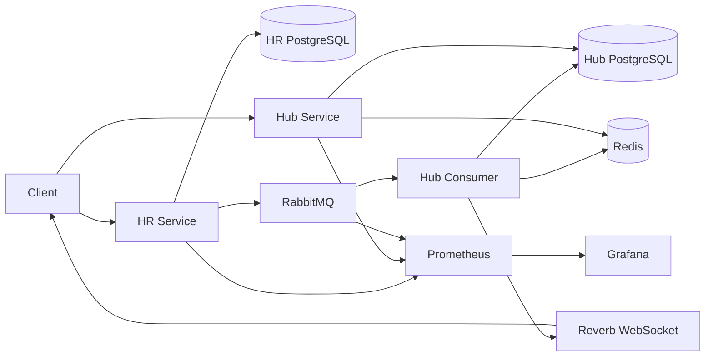

# Event-Driven Multi-Country HR Platform

A production-ready Laravel microservices platform for employee onboarding across multiple countries. It separates writes and reads into dedicated services, propagates employee lifecycle events through RabbitMQ, keeps read APIs fast with Redis, and exposes real-time updates and observability out of the box.

This README stays intentionally high level. Detailed architecture, API behavior, event contracts, testing, and operational guidance live in the docs.

## Best Way To Read The Docs

The hosted website docs are the best way to browse the case study end to end:

[Event-Driven Multi-Country HR Platform Case Study](https://ahmedsamirsherif.github.io/laravel-event-driven-microservices-blueprint/#overview)

The Overview page also includes a playable demo video tab.

## Quick Start

```bash
docker compose up -d --build
# or
make up
```

That command builds and starts the full local platform, runs migrations, and brings up the supporting infrastructure.

## What The Platform Includes

- HR Service for employee write operations
- Hub Service for read APIs and server-driven onboarding data
- RabbitMQ-based asynchronous event pipeline
- Redis-backed caching for read-heavy endpoints
- Laravel Reverb for WebSocket broadcasting
- Prometheus and Grafana for monitoring
- Docker Compose orchestration for local startup

## Main Services

| Service | Responsibility |
|---------|----------------|
| `hr-service` | Owns employee CRUD and publishes employee events |
| `hub-service` | Serves read APIs, projections, and UI-oriented responses |
| `hub-consumer` | Consumes RabbitMQ events and updates Hub projections |
| `rabbitmq` | Message broker for employee lifecycle events |
| `redis` | Cache store for employee and checklist responses |
| `reverb` | WebSocket broadcasting server |
| `prometheus` | Metrics collection |
| `grafana` | Metrics dashboards |

## Main Endpoints

| URL | Purpose |
|-----|---------|
| `http://localhost:8001` | HR Service API |
| `http://localhost:8001/docs/api` | HR OpenAPI docs |
| `http://localhost:8002` | Hub Service API |
| `http://localhost:8002/docs/api` | Hub OpenAPI docs |
| `http://localhost:8002/websocket-test.html` | WebSocket test page |
| `http://localhost:15672` | RabbitMQ Management UI |
| `http://localhost:9090` | Prometheus |
| `http://localhost:3001` | Grafana |

## Documentation

Detailed documentation lives in the [docs/](docs/) folder.

The static docs site intended for GitHub Pages lives in [website-docs/](website-docs/). The Pages workflow publishes that directory as the site root, so [website-docs/index.html](website-docs/index.html) becomes `/` on the published site.

| Doc | Description |
|-----|-------------|
| [Overview](docs/overview.md) | Platform summary and current status |
| [Installation](docs/installation.md) | Prerequisites, startup, health checks, credentials |
| [Architecture](docs/architecture.md) | Service boundaries, layers, and structure |
| [Why DDD?](docs/whyddd.md) | Why the codebase uses pragmatic DDD instead of default Laravel MVC |
| [Country Resolver](docs/countryresolver.md) | Request-time lifecycle of country module discovery and validation resolution |
| [CQRS](docs/cqrs.md) | Write/read separation and projection model |
| [Event Flow](docs/eventflow.md) | RabbitMQ flow, retries, DLQ, consumer pipeline |
| [Caching](docs/caching.md) | Cache strategy and invalidation rules |
| [Performance & Optimization](docs/performance-optimization.md) | Cross-layer performance decisions, caching, indexing, Docker, and observability optimizations |
| [Countries](docs/countries.md) | Country-specific behavior and extensibility |
| [API Reference](docs/api.md) | Endpoints, validation, and response formats |
| [Testing](docs/testing.md) | Test suites and execution commands |
| [Observability](docs/observability.md) | Metrics and monitoring setup |
| [Grafana](docs/grafana.md) | Dashboard coverage |
| [Hub UI](docs/hubui.md) | Server-driven UI behavior |
| [Deviations](docs/deviations.md) | Design deviations and rationale |
| [ADRs](docs/adr.md) | Architecture decision records |

## Architecture At A Glance



At a high level, the HR service owns writes, RabbitMQ carries employee lifecycle events, the Hub side builds read projections, Redis accelerates read-heavy endpoints, and Reverb pushes processed changes to connected clients.

## Key Details

- The platform follows a CQRS-style split: HR handles writes, Hub handles reads.
- Each service has its own PostgreSQL database, keeping write and read concerns isolated.
- Country-specific behavior is modular, with USA and DEU implemented as separate country modules.
- The local stack includes the application services, data stores, broker, WebSocket server, and monitoring stack in one Compose project.

## Core Flow

1. A client creates or updates an employee through the HR service.
2. HR persists the change and publishes an employee event to RabbitMQ.
3. The Hub consumer processes the event and updates the read projection.
4. Hub APIs serve the updated data, while Reverb broadcasts the change in real time.

## Notes

- Run Docker Compose from the repository root.
- Use the docs for API payloads, event schemas, country rules, test commands, and architectural detail.
- Keep the README as the entry point, not the full system manual.
