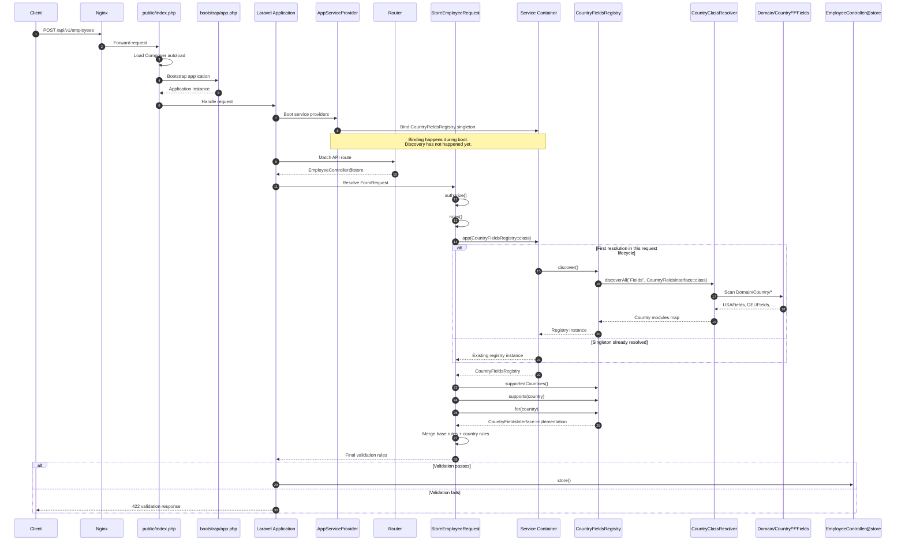

# Country Resolver Lifecycle

This page focuses on the exact runtime path that reaches the country-specific validation modules in the HR service. The key point is that the registry is **bound during boot** but only **discovered lazily** when request validation asks for it.

> **Registry vs resolver:** `CountryFieldsRegistry` is the container-facing registry used by the request layer. It delegates discovery to `CountryClassResolver`, which scans `Domain/Country/*` and instantiates matching classes.

## Request to Registry Trigger

## What Actually Triggers It

1. The registry is registered in the container by `AppServiceProvider`.
2. The HTTP route resolves `StoreEmployeeRequest` before the controller action executes.
3. `StoreEmployeeRequest::rules()` calls `app(CountryFieldsRegistry::class)`.
4. That first container resolution runs `CountryFieldsRegistry::discover()`.
5. The registry uses `CountryClassResolver::discoverAll()` to build the country map.
6. The request then asks the registry for the selected country and merges its validation rules.

## Why This Matters

### Lazy Discovery

No scan runs unless a request path actually needs country-specific behavior.

### Zero Manual Registration

Adding a new country means adding the convention-matching class, not updating a switch or service map.

### Request-Time Validation

The selected country determines the extra rules only when request data is available.

## Related Pages

- [Countries](countries.md) covers the high-level auto-discovery model and how to add a new country.
- [Architecture](architecture.md) shows where the resolver sits in the overall service design.