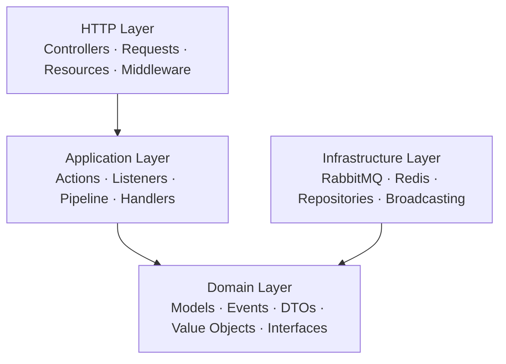

# Why DDD?

This platform uses **Pragmatic Domain-Driven Design** instead of the conventional Laravel MVC approach. This page explains the reasoning, the trade-offs, and what each layer provides compared to the default Laravel structure.

---

## The Problem with Default Laravel Structure

Laravel's default directory layout groups code by technical role: controllers in one folder, models in another, requests in a third. This works well for small applications, but as a system grows the boundaries blur.

| Concern | Default Laravel | What Goes Wrong at Scale |
|---|---|---|
| Business logic location | Controllers, Models, or "Service" classes | Logic scatters across layers. A single business rule might live in a controller, a model accessor, and a form request simultaneously. |
| Model responsibilities | Eloquent Models handle persistence, validation, relationships, scopes, accessors, and domain logic | Models become "God Objects": 500+ line files that do everything. Testing any single behavior requires setting up the entire ORM. |
| Cross-service contracts | No convention | When two services need to agree on a data shape, there's nothing guiding where the contract lives or how it's enforced. |
| Country-specific rules | Typically `if/else` chains or `switch` statements in controllers | Adding a country means modifying existing code in multiple places, violating Open/Closed Principle. |
| Testability | Feature tests that boot the entire framework | Slow test suites. You can't test a business rule without a database connection. |

## What DDD Gives This Platform

DDD organizes code by business concept first, technical role second. Each layer has a clear responsibility and dependency direction:



The arrow direction is critical: **Domain depends on nothing**. Everything else depends on Domain. This means business rules are isolated, testable, and portable.

## Layer-by-Layer: What Lives Where

### Domain Layer

Pure business logic. No framework imports, no database queries, no HTTP concerns.

| Component | Purpose | Example |
|---|---|---|
| Models | Business entities with their invariants | `Employee`: fillable fields, casts |
| Events | Things that happened in the domain | `EmployeeCreated`, `EmployeeUpdated`, `EmployeeDeleted` |
| Value Objects | Immutable, self-validating types | `SSN` validates `^\d{3}-\d{2}-\d{4}$`, `TaxId` validates `^DE\d{9}$`, `Salary` enforces `>= 0` |
| DTOs | Typed data bags for crossing layer boundaries | `CreateEmployeeDTO`, `UpdateEmployeeDTO` as `readonly` objects |
| Repository Interfaces | Contracts for data access, not implementations | `EmployeeRepositoryInterface`: `create()`, `update()`, `delete()`, `findOrFail()` |
| Country Contracts | Extension point for country-specific behavior | `CountryFieldsInterface` in HR, `CountryModuleInterface` in Hub |

### Application Layer

Orchestrates domain objects to fulfill use cases. Thin: no business rules here, just coordination.

| Component | Purpose | Example |
|---|---|---|
| Actions | Single-responsibility use cases | `CreateEmployeeAction` calls repository, dispatches domain event |
| Listeners | React to domain events | `PublishEmployeeEventToRabbitMQ` builds payload from a domain event and delegates to the publisher |
| Pipeline | Multi-step event processing | `EventProcessingPipeline` handles idempotency, logging, handler dispatch, and completion marking |
| Handlers | Process specific event types | `EmployeeCreatedHandler` upserts the projection and invalidates cache |

### Infrastructure Layer

Implements domain interfaces with concrete technology. Swappable without touching business logic.

| Component | Purpose | Example |
|---|---|---|
| Repositories | Concrete data access | `EloquentEmployeeRepository` implements `EmployeeRepositoryInterface` |
| Messaging | AMQP transport | `RabbitMQPublisher`, `RabbitMQConsumer` |
| Cache | Cache management | `EmployeeCacheManager`, `ChecklistCacheManager` |
| Broadcasting | WebSocket events | `EmployeeUpdatedBroadcast` through Reverb |
| Country Resolution | Auto-discovery of country modules | `CountryClassResolver`, `CountryRegistry` |

### HTTP Layer

Thin translation layer. Validates input, calls an Action, formats the response. Zero business logic.

| Component | Purpose | Example |
|---|---|---|
| Controllers | Receive HTTP and delegate to Actions | `EmployeeController::store()` validates via FormRequest, calls `CreateEmployeeAction`, returns a Resource |
| Form Requests | Input validation | `StoreEmployeeRequest` dynamically merges country-specific rules |
| Resources | Response formatting | `EmployeeResource` transforms the model to an API response |

## Side-by-Side Comparison

How the same create employee operation looks in each approach.

### Traditional Laravel

```php
// EmployeeController.php — everything in one place
public function store(Request $request)
{
    $request->validate([...]);                          // validation
    $employee = Employee::create($request->all());      // persistence
    if ($employee->country === 'USA') { ... }           // business logic
    event(new EmployeeCreated($employee));              // side effects
    Cache::forget('employees');                         // infrastructure
    return response()->json($employee, 201);            // presentation
}
```

### DDD Layered Approach (This Platform)

```php
// HTTP: StoreEmployeeRequest handles validation with country-specific rules from the registry
// HTTP: EmployeeController delegates to the action
public function store(StoreEmployeeRequest $request, CreateEmployeeAction $action)
{
    $dto = CreateEmployeeDTO::from($request->validated());
    $employee = $action->execute($dto);
    return new EmployeeResource($employee);
}

// Application: CreateEmployeeAction — one job
public function execute(CreateEmployeeDTO $dto): Employee
{
    $employee = $this->repository->create($dto);
    Event::dispatch(new EmployeeCreated($employee));
    return $employee;
}

// Application: listener reacts to the event as a separate concern
// PublishEmployeeEventToRabbitMQ builds the payload and publishes via RabbitMQPublisher

// Infrastructure: EloquentEmployeeRepository implements the interface
// Infrastructure: RabbitMQPublisher handles AMQP transport
// Infrastructure: Cache invalidation happens in Hub event handlers
```

## Why This Matters for a Multi-Country Platform

### 1. Country Extensibility: Open/Closed Principle

Adding a new country, for example France, requires **zero modifications to existing code**:

- HR Service: create `app/Domain/Country/FRA/FRAFields.php` implementing `CountryFieldsInterface`
- Hub Service: create `app/Domain/Country/FRA/FRAModule.php` implementing `CountryModuleInterface`
- `CountryClassResolver` auto-discovers it by convention, so there is no manual registration

In traditional Laravel, this would usually mean editing controllers, validation logic, form requests, and view logic across multiple files.

### 2. Two Services, One Domain Language

Both HR and Hub services share the same domain vocabulary: `Employee`, `CountryCode`, and domain events, while having completely independent infrastructure. DDD makes this boundary explicit. The domain is portable and the infrastructure is swappable.

### 3. Event-Driven Architecture Needs Clear Boundaries

When services communicate through events:

- **Domain events** like `EmployeeCreated` are plain DTO-style domain messages that carry business data only
- **Listeners** in the Application layer translate domain events into infrastructure actions like publishing to RabbitMQ
- **Broadcast events** like `EmployeeUpdatedBroadcast` live in Infrastructure because they are delivery mechanisms, not business concepts

Without DDD layers, domain events and broadcast events get mixed together. The architecture tests enforce this separation:

```php
test('domain events do not implement ShouldBroadcast')
    ->expect('App\\Domain')
    ->not->toImplement(ShouldBroadcast::class);
```

### 4. Testability

| Test Type | What It Tests | Dependencies |
|---|---|---|
| Unit (Domain) | Value Objects, DTOs, domain logic | None, pure PHP |
| Unit (Application) | Actions, Handlers, Pipeline | Mocked interfaces only |
| Feature | Full HTTP cycle | PostgreSQL test database |
| Architecture | Layer dependency rules | None, static analysis |
| Contract | Event schema compliance | None, JSON Schema validation |

Domain value objects like `SSN` and `TaxId` are tested in complete isolation: no database, no framework boot, no HTTP stack.

## Pragmatic, Not Purist

This is **Pragmatic DDD**, not a textbook implementation. The platform makes deliberate compromises for Laravel ergonomics.

| Pure DDD Would... | This Platform Does... | Rationale |
|---|---|---|
| Ban Eloquent from the Domain layer | Allows Eloquent Models in Domain | Fighting Laravel's ORM creates unnecessary friction. Treating models as domain entities is the more pragmatic trade-off here. See ADR-003. |
| Use Domain Services for all orchestration | Uses Action classes with one responsibility | Actions are simpler, more testable, and align with Laravel conventions. |
| Implement aggregates with strict consistency boundaries | Uses simple Eloquent Models as aggregates | The Employee entity does not have complex sub-entity relationships that justify aggregate overhead. |
| Abstract all infrastructure behind interfaces | Injects some infrastructure classes directly | Cache managers and metrics services are unlikely to be swapped. Interfaces are used where they add value. |

## Directory Comparison

**Default Laravel**

```text
app/
├── Http/Controllers/
├── Models/
├── Events/
├── Listeners/
├── Jobs/
├── Mail/
├── Notifications/
├── Policies/
├── Providers/
└── Services/
```

**DDD Layered (This Platform)**

```text
app/
├── Domain/
│   ├── Employee/
│   │   ├── Models/
│   │   ├── Events/
│   │   ├── DTOs/
│   │   ├── ValueObjects/
│   │   └── Repositories/
│   ├── Country/
│   │   ├── Contracts/
│   │   ├── Shared/
│   │   ├── USA/
│   │   └── DEU/
│   └── Shared/Enums/
├── Application/
│   └── Employee/
│       ├── Actions/
│       ├── Listeners/
│       └── Handlers/
├── Infrastructure/
│   ├── Repositories/
│   ├── Messaging/
│   ├── Cache/
│   └── Broadcasting/
└── Http/
    ├── Controllers/
    ├── Requests/
    └── Resources/
```

The DDD structure makes the domain visible at the folder level. Opening `Domain/Country/` immediately tells you the system handles multiple countries. Opening `Domain/Employee/ValueObjects/` tells you types like SSN and TaxId carry business validation. The structure communicates intent.